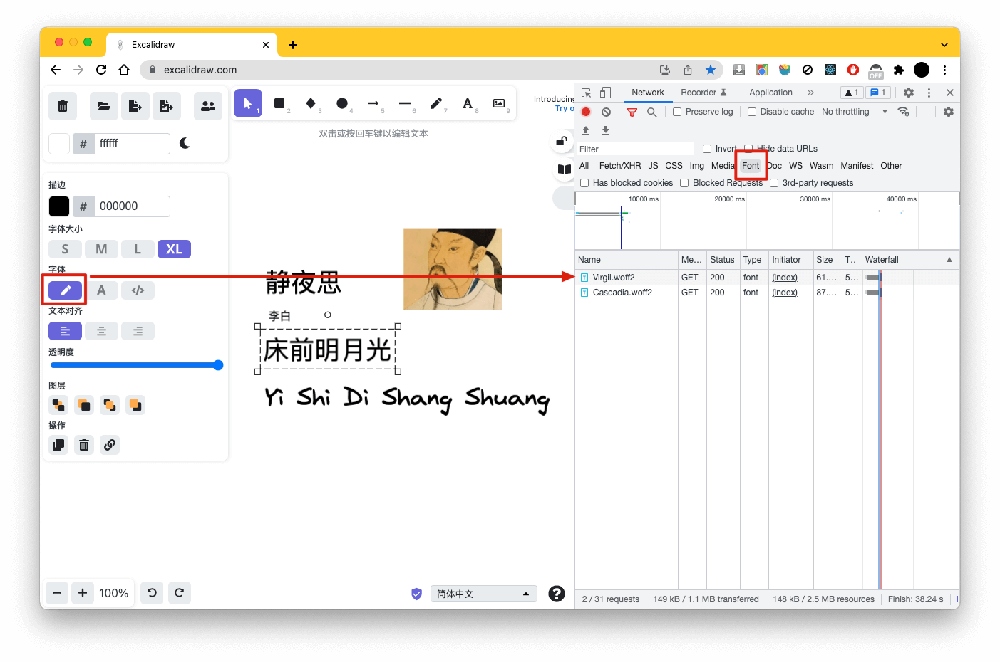
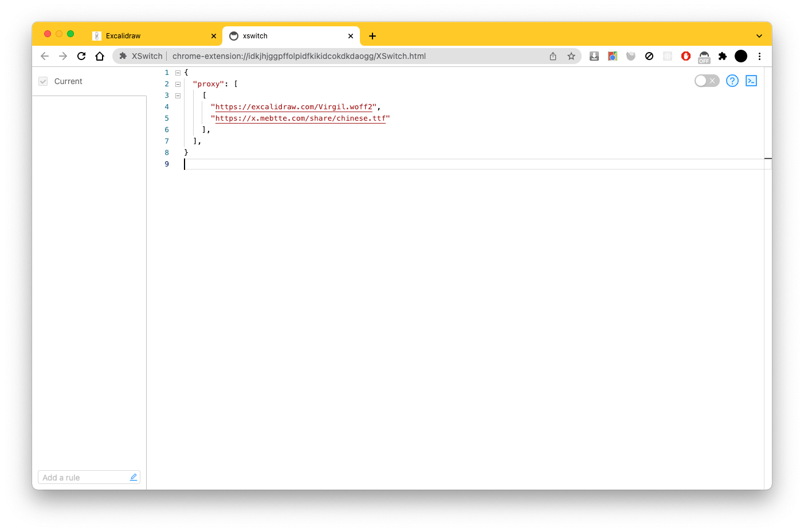
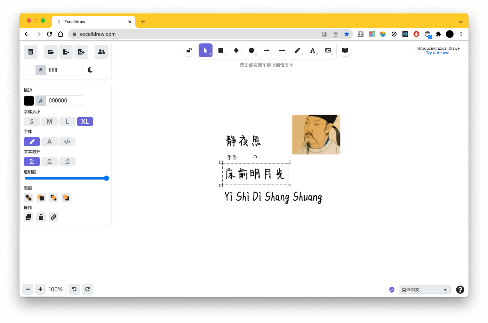

# Excalidraw

什么是 [Excalidraw](https://github.com/excalidraw/excalidraw) ?

> 如果想查看之前替换字体自定义部署的方式, 请查看[这里](https://github.com/mebtte/excalidraw/tree/7921cb44aaeb9da94d49d371d645510b1e99572c)

Excalidraw 手写字体只支持英文, 不支持中文.

手写字体文件是通过网络加载的, 所以可以通过劫持字体文件请求然后改写到自己的字体链接, 就可以达到替换字体的目的.

通过浏览器的 Network 面板可以找到`手写字体`的请求是 `https://excalidraw.com/Virgil.woff2`.

改写浏览器请求可以通过 [XSwitch](https://chrome.google.com/webstore/detail/xswitch/idkjhjggpffolpidfkikidcokdkdaogg) 插件.

之后将想要的字体托管为静态资源(或者本地部署), 在 XSwitch 中添加 `proxy` 配置将 Excalidraw 的手写字体链接替换成自己的字体链接:

> 上面的字体链接只是展示, 请替换成自己的字体链接

启用 XSwitch 然后刷新 Excalidraw, 可以发现自定义字体已生效:

如果没有生效, 可以清空缓存再进行刷新.
